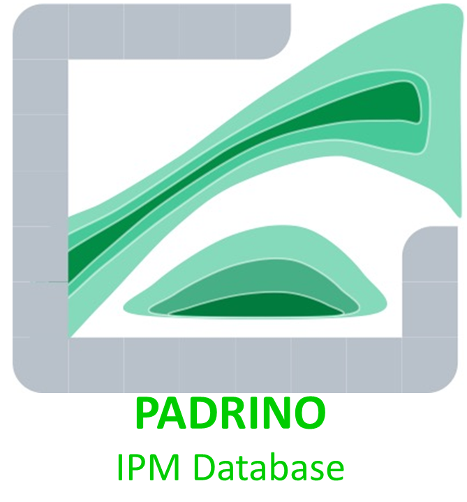

<!-- README.md is generated from README.Rmd. Please edit that file -->

## Padrino 

This repo hosts the code used to generate and upload data to the
`Padrino` data base, as well as the flat tables that comprise both raw
and clean versions of it. Users will find a clean interface between the
database and `R` in the
[`Rpadrino`](https://github.com/padrinoDB/Rpadrino) package.

Currently, the data base is a set of 10 text files that consist of ASCII
representation of model formulae, the coefficients associated with said
models, and the upper/lower bounds of the state variables. Additionally,
there are metadata to aid IPM selection, and further information on
continuous and discrete environmental variation whenever it is present.

Since the database itself isn’t especially useful without an engine that
translates IPM formulae into parse-able code, I strongly suggest using
the `Rpadrino` interface to download it, select models, and generate
kernels! However, if you’re interested in the structure, see the
`padrino-database/clean` folder for the tables.

## Useful Numbers

Current number of unique species, unique publications, and unique
`ipm_id`s that are in PADRINO, and have been quality checked for
accuracy. Quality checked means that for deterministic models, the
asymptotic per-capita growth rate (*λ*) is within  ± 0.03 of the
published point estimate value. For stochastic models, we check for
approximately the same stochastic population growth rate
(*λ**s*), but do not try to replicate the analysis, as this
usually requires too many computing resources to be feasible.

| \# of Species | \# of Publications | \# of IPM id’s |
|--------------:|-------------------:|---------------:|
|            56 |                 40 |            280 |

## For developers

For now, all commits will go to the `main` branch as this is still so
early in development that keeping a separate `devel` branch is
pointless. This will change immediately before/after the first major
release.

Development of the package `Rpadrino` is taking place over
[here](https://github.com/padrinoDB/Rpadrino).

## For Compadrinos

The digitization guide and other help files are located in
`metadata/digitization` and on the project’s
[webpage](https://padrinoDB.github.io/Padrino/). The
[pdbDigitUtils](https://github.com/padrinoDB/pdbDigitUtils) package can
help detect some problems with freshly digitized models. The
digitization guide has more information on how that package works.
